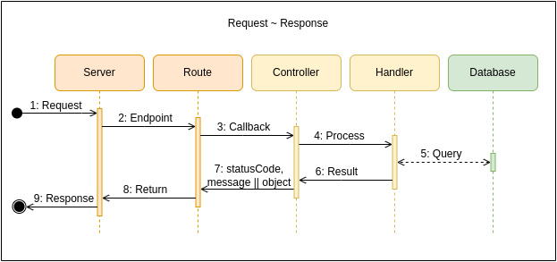

# Red-Boar-Inn API

>

- [Red-Boar-Inn API](#red-boar-inn-api)
  - [Structure](#structure)
  - [Endpoints](#endpoints)
  - [Diagrams](#diagrams)
    - [Architecture](#architecture)
    - [UseCases](#usecases)
    - [Auth routes](#auth-routes)
    - [Customer routes](#customer-routes)
    - [Password routes](#password-routes)
    - [Entity](#entity)
    - [Request Response](#request-response)

## Structure

[STRUCTURE.md](STRUCTURE.md)

## Endpoints

## Diagrams

### Architecture

### UseCases

### Auth routes

### Customer routes

### Password routes

### Entity

### Request Response

