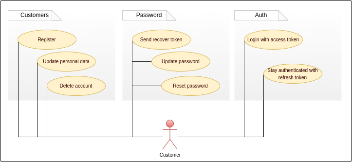

# Red-Boar-Inn API

> Projeto Server - API utilizando **NodeJs** para o jogo **Red Boar Inn**

- [Red-Boar-Inn API](#red-boar-inn-api)
  - [Structure](#structure)
  - [Endpoints](#endpoints)
  - [Diagrams](#diagrams)
    - [Architecture](#architecture)
    - [Auth endpoint](#auth-endpoint)
    - [Customer endpoint](#customer-endpoint)
    - [UseCase](#usecase)
    - [Modeling](#modeling)
    - [Request Response](#request-response)

## Structure

[STRUCTURE.md](STRUCTURE.md)

## Endpoints

## Diagrams

### Architecture

### Auth endpoint

### Customer endpoint

### UseCase

### Modeling

### Request Response

