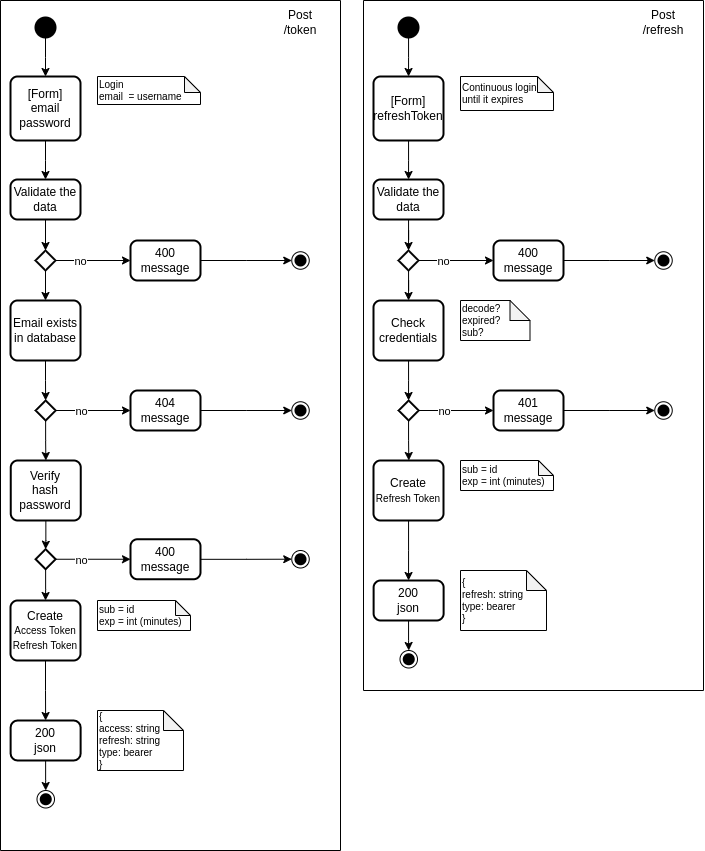
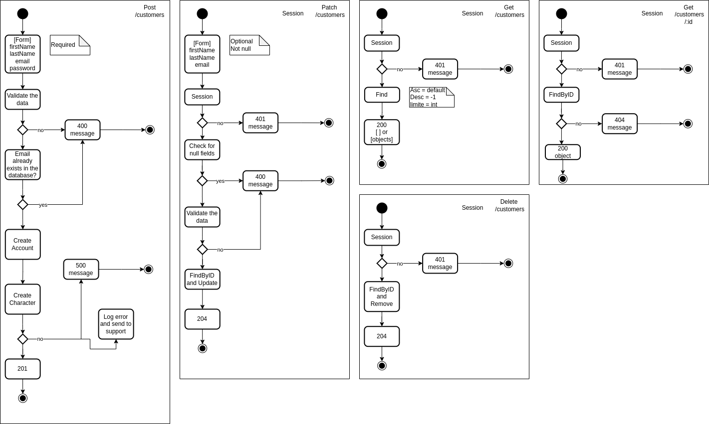
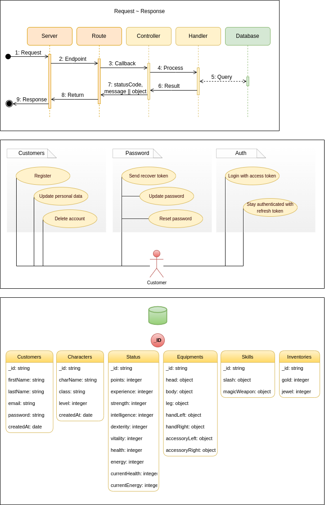

# Red-Boar-Inn API

> Projeto Server - API utilizando **NodeJs** para o jogo **Red Boar Inn**

- [Red-Boar-Inn API](#red-boar-inn-api)
  - [Estrutura](#estrutura)
  - [Modelagem](#modelagem)

## Estrutura

```sh
.
├── docs
│   ├── auth.png
│   ├── customers.png
│   ├── modeling.png
│   ├── README.md
│   ├── tasks.md
│   ├── tests.md
│   └── tips.md
├── src
│   ├── controllers
│   │   ├── handlers
│   │   │   ├── auth.handler.ts
│   │   │   └── customer.handler.ts
│   │   ├── requests
│   │   │   ├── auth.request.ts
│   │   │   └── customer.resquest.ts
│   │   ├── auth.controller.ts
│   │   └── customer.controller.ts
│   ├── entities
│   │   ├── interfaces
│   │   │   └── customer.interface.ts
│   │   └── customer.ts
│   ├── helpers
│   │   ├── http.exceptions.ts
│   │   └── http.protocols.ts
│   ├── middlewares
│   │   └── exceptions.ts
│   ├── models
│   │   ├── characters.model.ts
│   │   ├── customers.model.ts
│   │   ├── equipments.model.ts
│   │   ├── inventories.model.ts
│   │   ├── skills.model.ts
│   │   └── status.model.ts
│   ├── repositories
│   │   └── customer.repository.ts
│   ├── resources
│   │   ├── auth.ts
│   │   └── customer.ts
│   ├── security
│   │   ├── bcrypt.ts
│   │   ├── session.ts
│   │   └── token.ts
│   ├── services
│   │   └── mongodb.ts
│   ├── tests
│   │   ├── mock
│   │   │   └── customers.mock.ts
│   │   ├── resources
│   │   │   ├── auth
│   │   │   │   ├── access.spec.ts
│   │   │   │   └── refresh.spec.ts
│   │   │   └── customers
│   │   │       ├── delete.spec.ts
│   │   │       ├── get.spec.ts
│   │   │       ├── post.spec.ts
│   │   │       └── update.spec.ts
│   │   ├── security
│   │   │   ├── hash.pwd.spec.ts
│   │   │   └── token.spec.ts
│   │   ├── services
│   │   │   └── mongo.connect.spec.ts
│   │   ├── clients.ts
│   │   └── conftest.ts
│   ├── validators
│   │   ├── auth.validators.ts
│   │   ├── customer.validators.ts
│   │   └── validators.ts
│   ├── index.ts
│   └── server.ts
├── env.example
├── package.json
├── package-lock.json
├── tsconfig.json
├── vitest.config.ts
└── yarn.lock

22 directories, 54 files
```

## Modelagem




