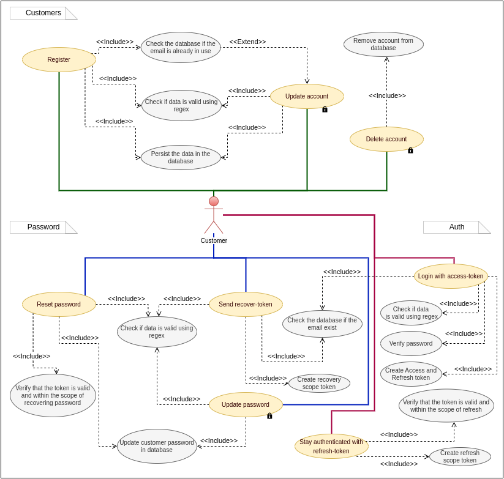
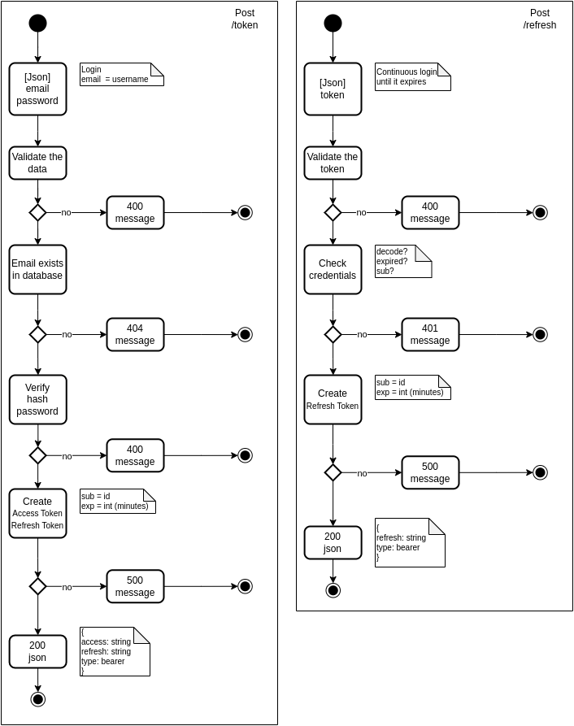
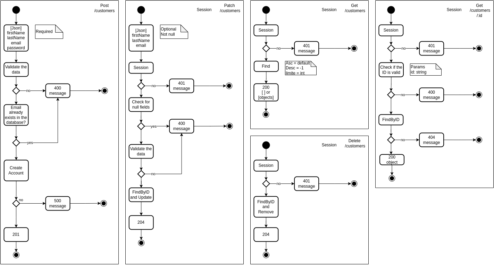
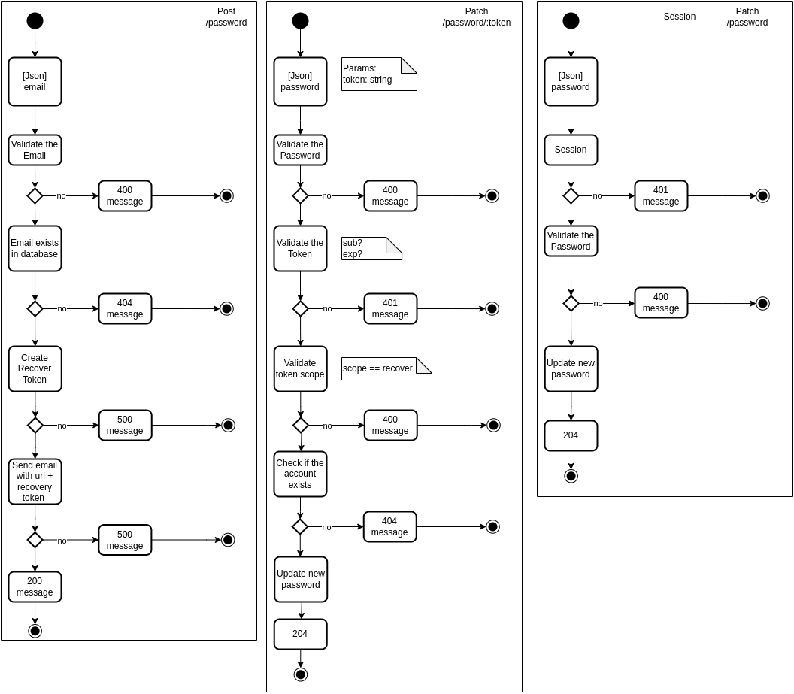
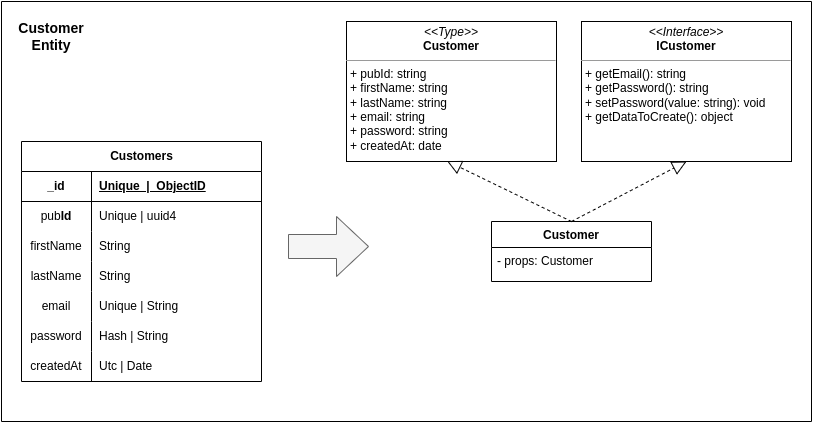

# Red-Boar-Inn Auth API

- [Red-Boar-Inn Auth API](#red-boar-inn-auth-api)
  - [Start](#start)
  - [Structure](#structure)
  - [Documentation](#documentation)
  - [Scripts](#scripts)
  - [Endpoints](#endpoints)
  - [Diagrams](#diagrams)
    - [Architecture](#architecture)
    - [UseCases](#usecases)
    - [Auth routes](#auth-routes)
    - [Customer routes](#customer-routes)
    - [Password routes](#password-routes)
    - [Entity](#entity)

## Start

[run - project](START.md)

## Structure

[tree - structure](STRUCTURE.md)

## Documentation

[doc - swagger](../swagger.json)

## Scripts

[scripts > tree - doc](../scripts/)

## Endpoints

## Diagrams

### Architecture

### UseCases

### Auth routes

### Customer routes

### Password routes

### Entity

