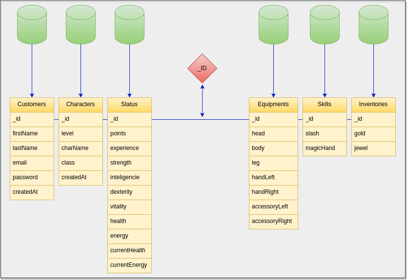
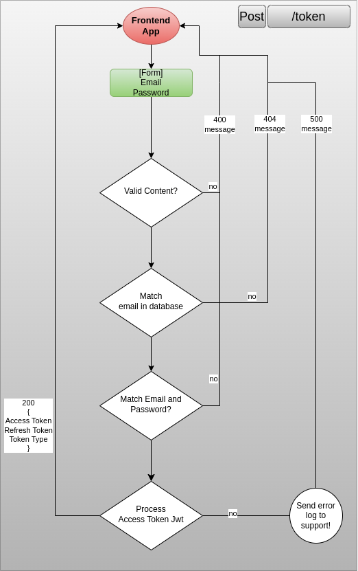
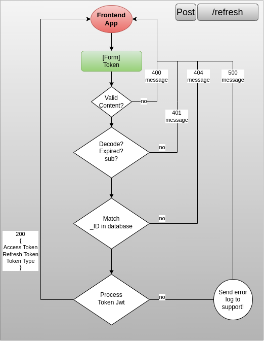
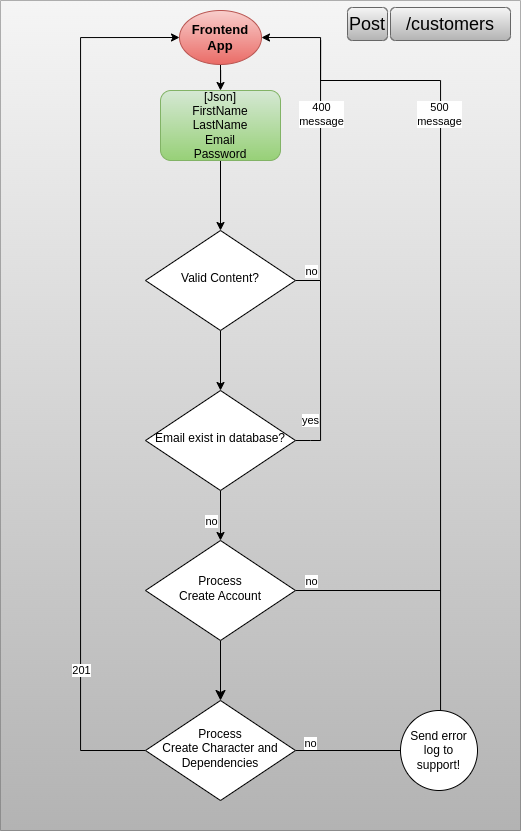
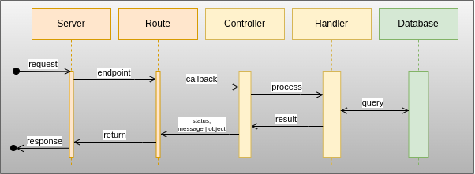

# Red-Boar-Inn API

> Projeto Server - API utilizando **NodeJs** para o jogo **Red Boar Inn**

- [Red-Boar-Inn API](#red-boar-inn-api)
  - [Estrutura](#estrutura)
  - [Modelagem](#modelagem)
  - [Diagramas - Auth](#diagramas---auth)
  - [Diagramas - Customers](#diagramas---customers)

## Estrutura

```sh
.
├── docs
│   ├── Diagrama-de-Fluxo-AccessToken.png
│   ├── Diagrama-de-Fluxo-Post-Customers.png
│   ├── Diagrama-de-Fluxo-RefreshToken.png
│   ├── Diagrama-de-Sequencia-Endpoints.png
│   ├── MBD-RBI.png
│   ├── README.md
│   ├── tasks.md
│   ├── tests.md
│   ├── tips.md
│   └── userCase.png
├── package.json
├── package-lock.json
├── src
│   ├── controllers
│   │   ├── customer.controller.ts
│   │   └── handlers
│   │       └── customer.handler.ts
│   ├── index.ts
│   ├── models
│   │   ├── characters.model.ts
│   │   ├── customers.model.ts
│   │   ├── entities
│   │   │   └── customer.ts
│   │   ├── equipments.model.ts
│   │   ├── inventories.model.ts
│   │   ├── schemas
│   │   │   ├── character.schema.ts
│   │   │   ├── customer.schema.ts
│   │   │   ├── equipment.schema.ts
│   │   │   ├── inventory.schema.ts
│   │   │   ├── skills.schema.ts
│   │   │   └── status.schema.ts
│   │   ├── skills.model.ts
│   │   └── status.model.ts
│   ├── resources
│   │   ├── auth.ts
│   │   └── customer.ts
│   ├── server.ts
│   ├── services
│   │   └── mongodb.ts
│   └── tests
│       ├── clients.ts
│       ├── conftest.ts
│       ├── mock
│       │   └── customers.mock.ts
│       ├── resources
│       │   ├── auth.spec.ts
│       │   └── customers.spec.ts
│       └── services
│           └── mongo.connect.spec.ts
├── tsconfig.json
├── vitest.config.ts
└── yarn.lock

13 directories, 41 files
```

## Modelagem

|                     |                           |
| ------------------- | :-----------------------: |
|  |  |

## Diagramas - Auth

|                                                   |                                                     |
| ------------------------------------------------- | :-------------------------------------------------: |
|  |  |

## Diagramas - Customers

|                                                    |                                                   |
| -------------------------------------------------- | :-----------------------------------------------: |
|  |  |
